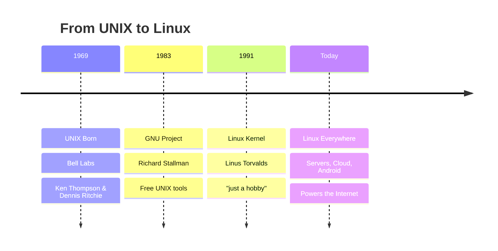
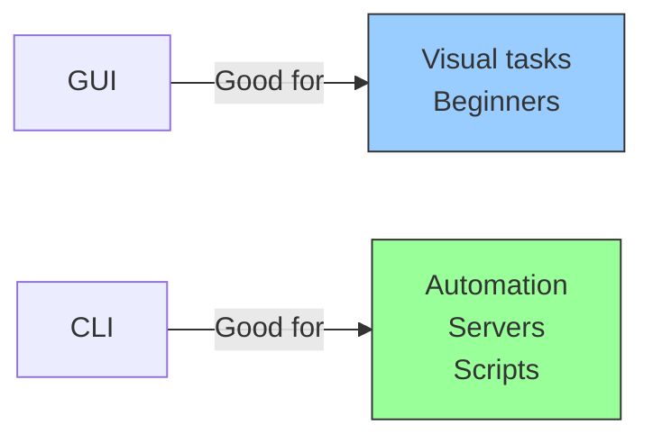
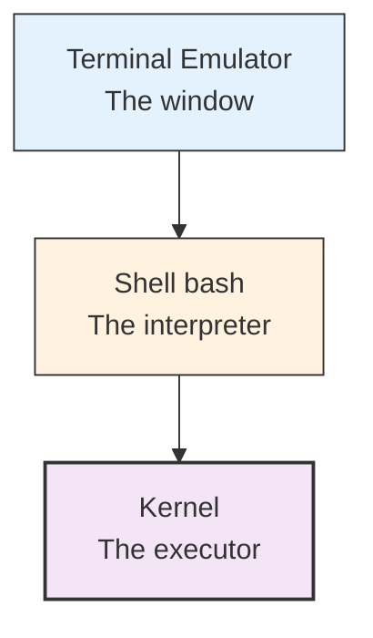
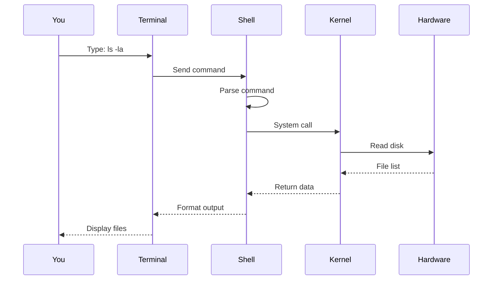
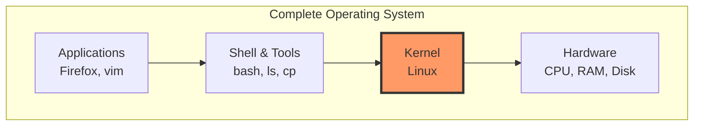
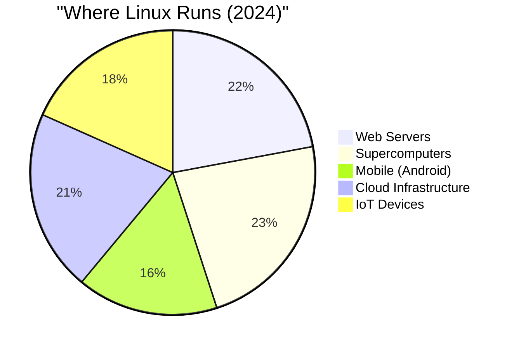
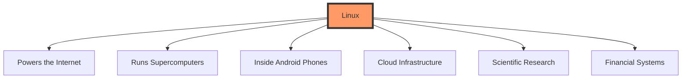
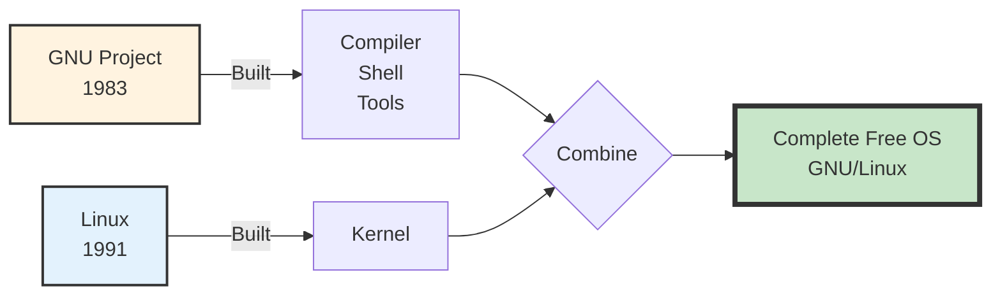

<!-- end_slide -->

# Linux Essentials 🐧

## Part 1: Foundations

<!-- pause -->

**Today's Topics:**

<!-- incremental_lists: true -->

1. Quick History: UNIX → GNU → Linux
2. Understanding the Terms
3. Why Linux Dominates
4. GNU & Free Software

<!-- speaker_note:
60-minute focused workshop
Keep it concise and practical
Emphasize key concepts only
-->

<!-- end_slide -->

# The Evolution ⏱️



<!-- speaker_note:
30-year journey in one slide
Each step solved a real problem
Community-driven development
-->

<!-- end_slide -->

# 1969: UNIX 🌟

<!-- columns -->

<!-- column: 0.5 -->

**The Innovation:**
* Multi-user system
* Multi-tasking
* Written in C (portable!)
* Hierarchical file system

<!-- column: 0.5 -->

**The Problem:**
* Proprietary
* Very expensive
* Closed source
* Universities couldn't afford it

<!-- reset_layout -->

<!-- pause -->

> "Do one thing and do it well" - UNIX Philosophy

<!-- speaker_note:
UNIX was revolutionary but expensive
$50,000+ for hardware + license
This created demand for free alternative
-->

<!-- end_slide -->

# 1983: GNU Project 🦬

<!-- pause -->

**Richard Stallman's Mission:**
* Create a free UNIX-like system
* GNU = "GNU's Not Unix"

<!-- pause -->

<!-- columns -->

<!-- column: 0.5 -->

**What GNU Built:**
* ✅ GCC compiler
* ✅ bash shell
* ✅ Core tools (ls, cp, mv)
* ✅ Text editor (emacs)

<!-- column: 0.5 -->

**What Was Missing:**
* ❌ **The Kernel**

<!-- reset_layout -->

<!-- speaker_note:
GNU had everything except the kernel
This was the missing piece
Linus would solve this problem
-->

<!-- end_slide -->

# 1991: Linux is Born! 🎉

**August 25, 1991 - Linus Torvalds:**

> "I'm doing a (free) operating system (just a hobby, won't be big and professional like GNU)"

<!-- pause -->

```mermaid
graph LR
    A[GNU Tools<br/>No Kernel] + B[Linux Kernel<br/>No Tools] = C[Complete<br/>Free OS!]
    
    style A fill:#fff3e0,stroke:#333
    style B fill:#e3f2fd,stroke:#333
    style C fill:#c8e6c9,stroke:#333,stroke-width:3px
```

<!-- pause -->

**The Perfect Match:**
* Linux provided the kernel
* GNU provided everything else
* Together = Full operating system

<!-- speaker_note:
Most famous understatement in computing!
Linux + GNU = GNU/Linux (but we say "Linux")
Now runs the world
-->

<!-- end_slide -->

<!-- jump_to_middle -->

# Understanding the Terms 📚

<!-- end_slide -->

# GUI vs CLI

<!-- columns -->

<!-- column: 0.5 -->

## GUI
**Graphical User Interface**

* Visual: windows, icons
* Point and click
* Easy to learn
* Limited automation

<!-- column: 0.5 -->

## CLI
**Command Line Interface**

* Text-based
* Type commands
* Steeper learning
* **Powerful automation**

<!-- reset_layout -->

<!-- pause -->



<!-- speaker_note:
Not either/or - use both!
GUI for visual work
CLI for automation and remote access
-->

<!-- end_slide -->

# Terminal vs Shell

<!-- pause -->

**Terminal** = The window (app you see)
* GNOME Terminal, iTerm2, Windows Terminal
* Just displays input/output

<!-- pause -->

**Shell** = The interpreter (runs inside terminal)
* bash, zsh, fish
* Translates your commands for the kernel

<!-- pause -->



<!-- speaker_note:
Terminal = display layer
Shell = logic layer
Often confused but different!
-->

<!-- end_slide -->

# The Complete Flow



<!-- speaker_note:
This is what happens when you type a command
Multiple layers working together
Each has a specific role
-->

<!-- end_slide -->

# Kernel vs Operating System

<!-- pause -->

**Kernel** = Core of the OS
* Manages hardware (CPU, RAM, disk)
* Process scheduling
* Memory management
* Device drivers

<!-- pause -->

**Operating System** = Complete system
* Kernel + Shell + Utilities + Applications

<!-- pause -->



<!-- speaker_note:
"Linux" technically = just the kernel
"Linux OS" = Linux kernel + GNU tools + apps
Most people just say "Linux"
-->
**Key Point:** Applications can't touch hardware directly!
* Must ask kernel via system calls
* Kernel validates and executes safely

<!-- speaker_note:
Kernel sits between apps and hardware
Provides protection and security
System calls are the only way to request services
-->

<!-- end_slide -->


# Why Linux is the Best 🏆

<!-- end_slide -->

# Linux Dominates Everything

<!-- pause -->



<!-- pause -->

**The Stats:**
* **96.3%** of top web servers
* **100%** of top 500 supercomputers
* **Billions** of Android devices
* AWS, Google Cloud, Azure
* Your router, smart TV, car

<!-- pause -->

> **If you used the internet today, you used Linux!**

<!-- speaker_note:
Linux literally runs the modern world
Even Microsoft runs Linux on Azure!
Android = Linux kernel + Google's userspace
-->

<!-- end_slide -->

# Why Linux Wins

<!-- pause -->

<!-- columns -->

<!-- column: 0.5 -->

## 💰 Free & Open
* No licensing costs
* Source code available
* Modify as needed
* No vendor lock-in

<!-- pause -->

## 🔒 Secure
* Open source review
* Fast security patches
* Less malware
* Granular permissions

<!-- column: 0.5 -->

<!-- pause -->

## ⚡ Powerful
* Runs for years without reboot
* Efficient resource usage
* Scales from Pi to supercomputers

<!-- pause -->

## 🎨 Customizable
* Change anything
* Pick your desktop
* Build your own distro

<!-- reset_layout -->

<!-- speaker_note:
Compare costs: Windows Server = $6000+, Linux = $0
Security: thousands of eyes reviewing code
Performance: servers run for years
Flexibility: make it exactly what you want
-->

<!-- end_slide -->

# The Numbers

<!-- pause -->

**Development Scale:**
* 30+ million lines of code
* 20,000+ contributors worldwide
* 15,000+ companies involved
* New kernel every 9-10 weeks

<!-- pause -->

**Real-World Usage:**
* Google, Facebook, Amazon - all Linux
* Stock exchanges, banks - Linux
* NASA, SpaceX - Linux
* Hollywood render farms - Linux

<!-- pause -->



<!-- speaker_note:
Most actively developed OS in history
Contributions from Intel, Google, Red Hat, etc.
Free software powering trillion-dollar industries
-->

<!-- end_slide -->

# GNU & Free Software 🦬

<!-- end_slide -->

# GNU + Linux: The Perfect Match

<!-- pause -->



<!-- pause -->

**Why "GNU/Linux"?**
* GNU provided: compiler, shell, tools (30+ years of work)
* Linux provided: kernel (the missing piece)
* Together: complete operating system

<!-- pause -->

**But we say "Linux" because:**
* Shorter and catchier
* Kernel was the crucial final piece
* Common usage

<!-- speaker_note:
Richard Stallman insists on "GNU/Linux"
Technically correct, but "Linux" stuck
Both contributions were essential
Together they changed the world
-->

<!-- end_slide -->
WSL: Linux on Windows 💻
<!-- end_slide -->
What is WSL?
<!-- pause -->
WSL = Windows Subsystem for Linux
<!-- pause -->
mermaidgraph TB
    subgraph Windows["Windows 10/11"]
        subgraph WSL["WSL Layer"]
            A[Linux Kernel] --> B[Ubuntu/Debian/etc.]
            B --> C[bash, apt, Linux tools]
        end
        D[Windows Apps] 
    end
    
    E[You] -->|Use both| D
    E -->|Use both| C
    
    style WSL fill:#e3f2fd,stroke:#333,stroke-width:2px
    style A fill:#c8e6c9,stroke:#333,stroke-width:2px
<!-- pause -->
What WSL Does:

Runs a real Linux kernel on Windows
Access Linux command line & tools
No dual boot or VM needed
Direct file system integration

<!-- pause -->
Two Versions:

WSL 1: Translation layer (faster file access)
WSL 2: Real Linux kernel (better compatibility) ⭐ Recommended

<!-- speaker_note:
WSL lets Windows users run Linux natively
Perfect for developers who need both systems
WSL 2 uses actual Linux kernel via virtualization
Can run Docker, compile code, use Linux tools
Files accessible from both Windows and Linux
-->
<!-- end_slide -->
Setting Up WSL 2
<!-- pause -->
Quick Setup (Windows 11 / Windows 10 2004+)
One Command (PowerShell as Admin):
powershellwsl --install
<!-- pause -->
What This Does:
<!-- incremental_lists: true -->

Enables WSL feature
Enables Virtual Machine Platform
Installs latest Linux kernel
Installs Ubuntu by default
Restarts your computer

<!-- pause -->
After Restart:
<!-- incremental_lists: true -->

Ubuntu will auto-launch
Create your Linux username
Set your password
You're in Linux! 🎉

<!-- speaker_note:
That's it! One command for modern Windows.
After restart, Ubuntu terminal opens automatically.
Username/password are for Linux only (separate from Windows).
You now have full Linux environment.
-->
<!-- end_slide -->
Using WSL
<!-- pause -->
Launch Linux:

Start menu → "Ubuntu" (or your distro)
Or type wsl in PowerShell/CMD
Or Windows Terminal (recommended)

<!-- pause -->
File Access:
<!-- columns -->
<!-- column: 0.5 -->
From Linux:
bash# Access Windows C: drive
cd /mnt/c/Users/YourName

# Your files are here!
ls /mnt/c/
<!-- column: 0.5 -->
From Windows:
\\wsl$\Ubuntu\home\username

Browse in File Explorer
Edit with VS Code
Full integration!

<!-- reset_layout -->
<!-- pause -->
Useful Commands:
bash# Update Linux packages
sudo apt update && sudo apt upgrade

# Install tools
sudo apt install git python3 nodejs

# Check WSL version
wsl --list --verbose
<!-- speaker_note:
Windows Terminal gives best experience - tabs, themes
Your Windows files at /mnt/c, /mnt/d, etc.
Linux files accessible via \\wsl$ in Windows
Can use Windows apps with Linux files and vice versa
-->
<!-- end_slide -->
# Next Up: Hands-On! 🚀

## Part 2: File System & Navigation

<!-- pause -->

**Get Ready To:**
* Explore the Linux file system
* Master essential commands
* Navigate like a pro

<!-- speaker_note:
Break time if needed
Make sure everyone has terminal access
Next section is practical
-->

<!-- end_slide -->
