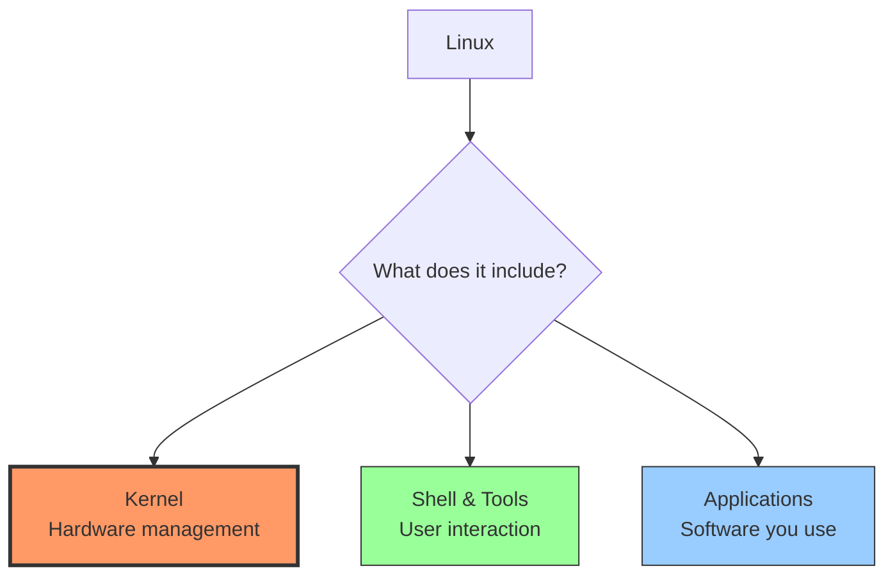
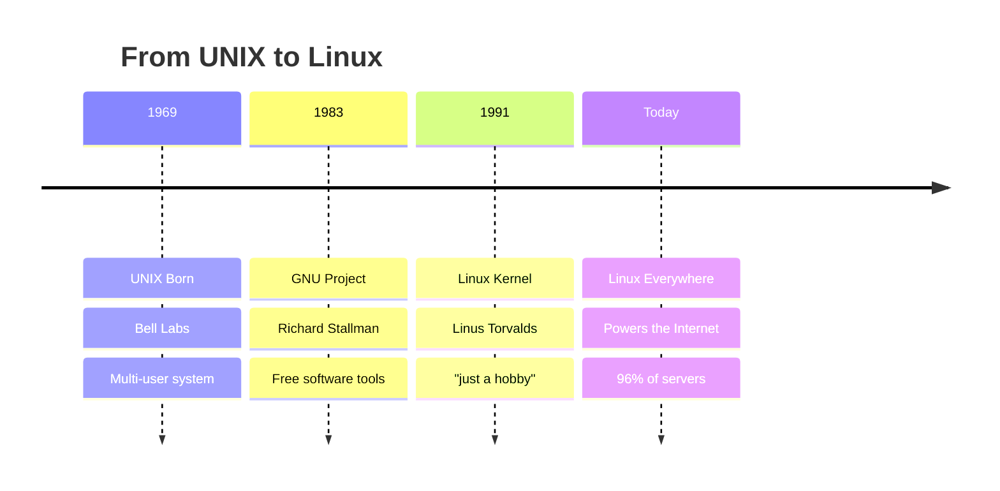
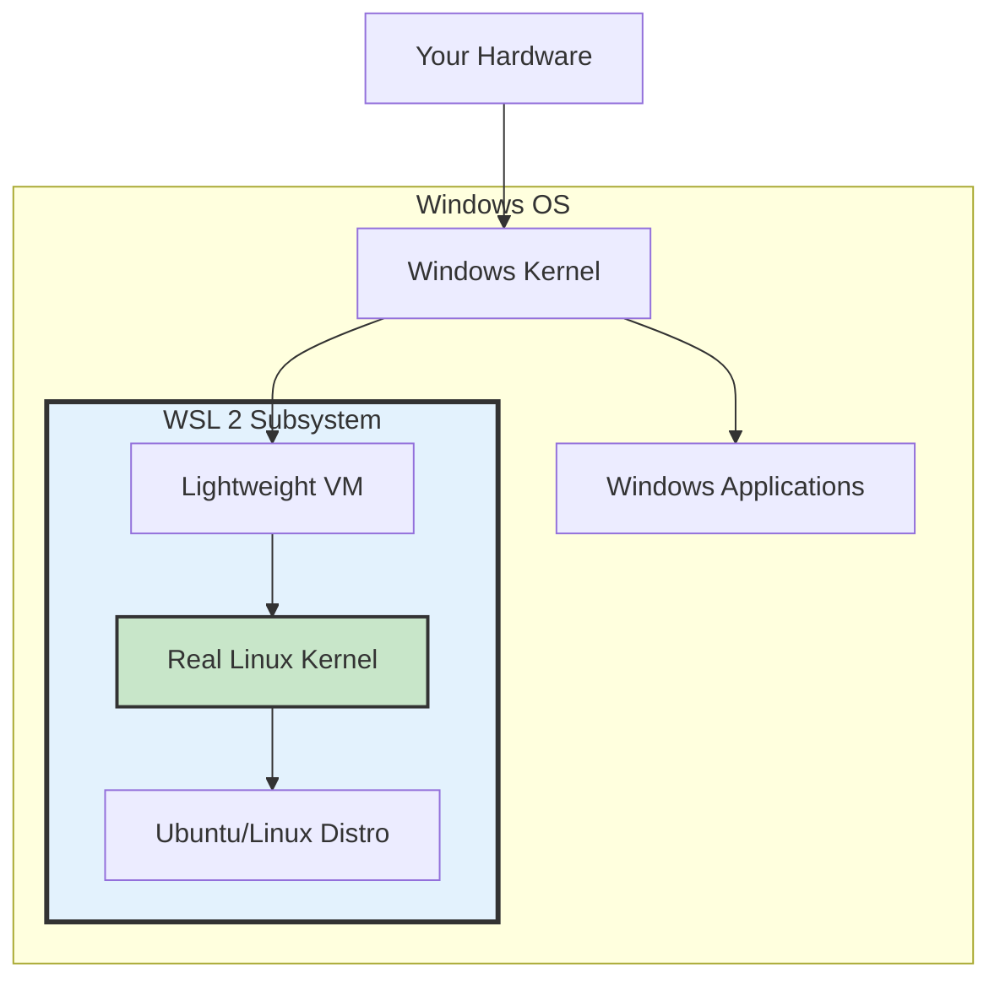
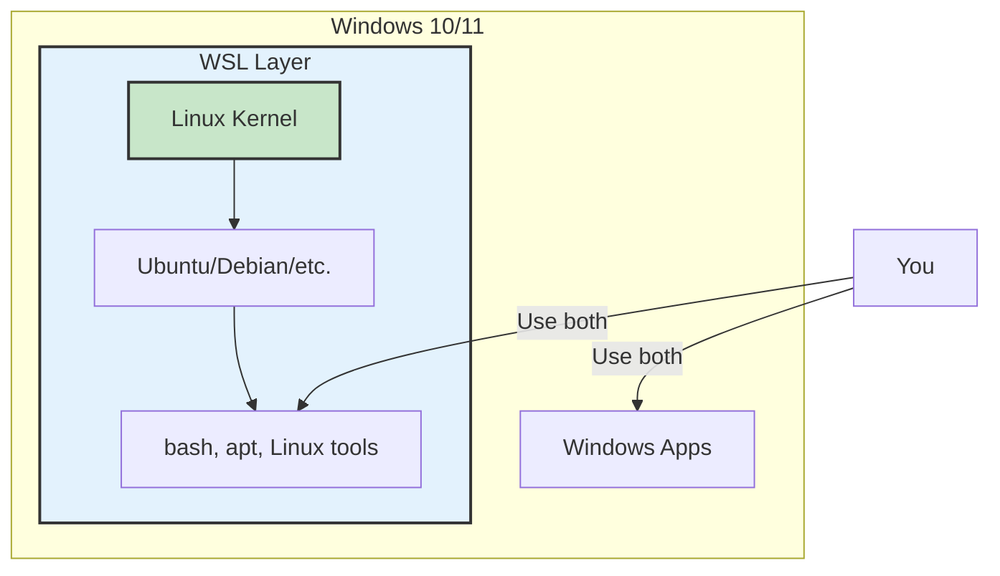

<!-- end_slide -->

# Linux Essentials

## Part 1: Foundations

<!-- pause -->

# What is Linux? 

<!-- end_slide -->

**Is Linux an Operating System** - like Windows or macOS ???

<!-- pause -->

More accurately:

<!-- incremental_lists: true -->

* **Linux** = The kernel (core of the OS)
* **GNU/Linux** = Complete operating system
* **Linux Distributions** = Packaged versions (Ubuntu, Fedora, etc.)

<!-- pause -->



<!-- speaker_note:
Start with the big picture
Linux powers most of the internet
Free and open source
We'll break down each component
-->

<!-- end_slide -->

<!-- jump_to_middle -->

# Understanding Kernel & OS 

<!-- end_slide -->

# What is a Kernel? 

<!-- pause -->

**The Kernel = The Core of the Operating System**

<!-- pause -->

**What it does:**

<!-- incremental_lists: true -->

* Manages hardware (CPU, RAM, disk)
* Controls processes (which programs run)
* Handles memory allocation
* Manages file systems
* Provides security & permissions

<!-- pause -->
<!-- end_slide -->

# What is an Operating System? 

<!-- pause -->

**Operating System = Complete System**

Kernel + Shell + Utilities + Applications

<!-- pause -->

```text
┌──────────────────────────────┐
│  Applications (User Space)   │  ← Firefox, games, etc.
├──────────────────────────────┤
│  Shell & Utilities           │  ← bash, ls, cp, mv
├──────────────────────────────┤
│  Kernel                      │  ← Linux kernel
├──────────────────────────────┤
│  Hardware                    │  ← CPU, RAM, Disk
└──────────────────────────────┘
```

<!-- pause -->

**Components:**
* **Kernel** - Core system management
* **System utilities** - Basic commands and tools
* **Shell** - Command interpreter
* **Desktop Environment** - Graphical interface (optional)
* **Applications** - Programs you use

<!-- end_slide -->

# Kernel vs Operating System

<!-- pause -->

**Kernel** = Just the core
* Linux is technically just a kernel
* ~30 million lines of code
* Created by Linus Torvalds

<!-- pause -->

**Operating System** = Everything
* Linux kernel + GNU tools + Desktop + Apps
* Called "Linux" but technically "GNU/Linux"
* Different "distributions" package it differently

<!-- pause -->

<!-- end_slide -->

<!-- jump_to_middle -->

# Why Linux? 

<!-- end_slide -->

<!-- pause -->

<!-- columns -->

<!-- column: 0.5 -->

## **Free & Open**
* No licensing costs
* Source code available
* Modify anything
* No vendor lock-in

## **Secure**
* Open source = peer reviewed
* Fast security patches
* Less malware
* Better permissions

<!-- column: 0.5 -->

##  **Powerful**
* Runs for years without reboot
* Efficient resources
* Scales to any size

##  **Dominant**
* 96% of web servers
* 100% of supercomputers
* Billions of Android phones
* All major cloud platforms

<!-- reset_layout -->

<!-- speaker_note:
Windows/Mac are proprietary and expensive
Linux is free and customizable
Most of the internet runs on Linux
If you use the internet, you use Linux!
-->

<!-- end_slide -->

# Why Linux as Students? 

<!-- pause -->

**Perfect for Learning:**

<!-- incremental_lists: true -->

1. **Free** - No cost for software
2. **Learn How Computers Work** - See inside the system
3. **Industry Standard** - Used in most tech companies
4. **Career Skills** - Linux knowledge = job opportunities
5. **Development** - Best environment for programming
6. **Customizable** - Make it yours

<!-- pause -->

**What You Can Do:**

<!-- columns -->

<!-- column: 0.5 -->

* Web development
* Python/Java/C++ programming
* Data science & ML
* Cybersecurity
* DevOps & Cloud

<!-- column: 0.5 -->

* Server management
* Docker & containers
* Git version control
* Database management
* Networking

<!-- reset_layout -->

<!-- speaker_note:
Linux is essential for CS/IT students
Most developer tools are built for Linux first
Learning Linux = learning how software really works
Companies hire Linux-skilled developers
Free means experiment without limits
-->

<!-- end_slide -->

<!-- jump_to_middle -->

# History of Linux 

<!-- end_slide -->

# The Evolution 



<!-- speaker_note:
Quick history - 30 years of evolution
Each step solved a real problem
UNIX was expensive → GNU made free tools
GNU needed kernel → Linus made Linux
Together = revolution
-->

<!-- end_slide -->

# 1969: UNIX 

<!-- columns -->

<!-- column: 0.5 -->

**The Innovation:**
* Multi-user system
* Multi-tasking
* Written in C (portable!)
* Hierarchical file system

<!-- column: 0.5 -->

**The Problem:**
* Proprietary
* Very expensive
* Closed source
* Universities couldn't afford it

<!-- reset_layout -->

<!-- pause -->

<!-- end_slide -->

# 1983: GNU Project 🦬

<!-- pause -->

**Richard Stallman's Mission:**
* Create a free UNIX-like system
* GNU = "GNU's Not Unix"

<!-- pause -->

<!-- columns -->

<!-- column: 0.5 -->

**What GNU Built:**
* ✅ GCC compiler
* ✅ bash shell
* ✅ Core tools (ls, cp, mv)
* ✅ Text editor (emacs)

<!-- column: 0.5 -->

**What Was Missing:**
* ❌ **The Kernel**

<!-- reset_layout -->

<!-- end_slide -->

# 1991: Linux is Born! 

**August 25, 1991 - Linus Torvalds:**

> "I'm doing a (free) operating system (just a hobby, won't be big and professional like GNU)"

<!-- pause -->

```mermaid
graph LR
    A[GNU Tools<br/>No Kernel] + B[Linux Kernel<br/>No Tools] = C[Complete<br/>Free OS!]
    
    style A fill:#fff3e0,stroke:#333
    style B fill:#e3f2fd,stroke:#333
    style C fill:#c8e6c9,stroke:#333,stroke-width:3px
```

<!-- pause -->
* Linux provided the kernel
* GNU provided everything else
* Together = Full operating system

<!-- speaker_note:
Most famous understatement in computing!
Linux + GNU = GNU/Linux (but we say "Linux")
Now runs the world
-->

<!-- end_slide -->

<!-- jump_to_middle -->

# How Linux Works 

<!-- end_slide -->

# How Linux Works: Backend Architecture

<!-- pause -->

```mermaid
graph TB
    subgraph User["You"]
        A[Type Command]
    end
    
    subgraph Terminal["Terminal/Shell"]
        B[bash interprets]
    end
    
    subgraph Kernel["Linux Kernel"]
        C[System Call Interface]
        D[Process Manager]
        E[Memory Manager]
        F[File System]
        G[Device Drivers]
    end
    
    subgraph Hardware["Physical Hardware"]
        H[CPU | RAM | Disk | Network]
    end
    
    A --> B
    B --> C
    C --> D
    C --> E
    C --> F
    C --> G
    D --> H
    E --> H
    F --> H
    G --> H
    
    style Kernel fill:#f3e5f5,stroke:#333,stroke-width:3px
    style Hardware fill:#c8e6c9,stroke:#333,stroke-width:2px
```

<!-- speaker_note:
This is the backend architecture of Linux
Shell translates commands to system calls
Kernel manages all hardware access
Applications never touch hardware directly
Protection and security built in
-->

<!-- end_slide -->

# How WSL Makes Linux Work on Windows

<!-- pause -->

**Traditional Approach:**
* Dual boot (separate partitions)
* Virtual Machine (VMware, VirtualBox)
* Slow and resource heavy

<!-- pause -->

**WSL Approach - Better!**



<!-- pause -->

**WSL Magic:**
* Runs real Linux kernel inside Windows
* Fast (uses lightweight virtualization)
* Shares files between Windows & Linux
* No reboot needed!

<!-- speaker_note:
WSL 2 runs actual Linux kernel via Hyper-V
Not emulation - real Linux system
Best of both worlds: Windows GUI + Linux power
Perfect for students who need both
-->

<!-- end_slide -->

<!-- jump_to_middle -->

# WSL Setup 

<!-- end_slide -->

# What is WSL?

<!-- pause -->

**WSL = Windows Subsystem for Linux**

<!-- pause -->



<!-- pause -->

**What WSL Does:**
* Runs a real Linux kernel on Windows
* Access Linux command line & tools
* No dual boot or VM needed
* Direct file system integration

<!-- pause -->

**Two Versions:**
* **WSL 1:** Translation layer (faster file access)
* **WSL 2:** Real Linux kernel (better compatibility)  Recommended

<!-- speaker_note:
WSL lets Windows users run Linux natively
Perfect for developers who need both systems
WSL 2 uses actual Linux kernel via virtualization
Can run Docker, compile code, use Linux tools
Files accessible from both Windows and Linux
-->

<!-- end_slide -->

# Setting Up WSL 2

<!-- pause -->

## Method 1: Automatic Setup  (Recommended)

**One Command (PowerShell as Admin):**

```powershell
wsl --install
```

<!-- pause -->

**What This Does:**
<!-- incremental_lists: true -->
1. Enables WSL feature
2. Enables Virtual Machine Platform
3. Installs latest Linux kernel
4. Installs Ubuntu by default
5. Restarts your computer

<!-- pause -->

## After Restart:
<!-- incremental_lists: true -->
1. Ubuntu will auto-launch
2. Create your Linux username
3. Set your password
4. You're in Linux! 

<!-- speaker_note:
Method 1 works on Windows 10 (version 2004+) and Windows 11
This is the easiest and recommended method
After restart, Ubuntu terminal opens automatically
Username/password are for Linux only (separate from Windows)
-->

<!-- end_slide -->

# Manual Setup (If Automatic Fails)

<!-- pause -->

## Step 1: Enable WSL Feature

**Run in PowerShell (Admin):**

```powershell
dism.exe /online /enable-feature /featurename:Microsoft-Windows-Subsystem-Linux /all /norestart
```

<!-- pause -->

## Step 2: Enable Virtual Machine Platform

```powershell
dism.exe /online /enable-feature /featurename:VirtualMachinePlatform /all /norestart
```

<!-- pause -->

## Step 3: Restart Computer

**Restart Windows now!**

<!-- speaker_note:
Use this method if wsl --install doesn't work
Usually needed on older Windows 10 versions
Both commands must complete successfully
Don't skip the restart!
-->

<!-- end_slide -->

# Manual Setup (Continued)

<!-- pause -->

## Step 4: Download & Install WSL 2 Kernel

**Visit:**
```
https://aka.ms/wsl2kernel
```

Download and install the update package

<!-- pause -->

## Step 5: Set WSL 2 as Default

**Run in PowerShell (Admin):**

```powershell
wsl --set-default-version 2
```

<!-- pause -->

## Step 6: Install Linux Distribution

```powershell
# Install Ubuntu (recommended for beginners)
wsl --install -d Ubuntu

# Or choose another:
wsl --list --online    # See all available distros
wsl --install -d Debian
wsl --install -d Kali-Linux
```

<!-- pause -->

## Step 7: Launch & Setup

* Start menu → "Ubuntu"
* Create username and password
* Done! 

<!-- speaker_note:
After kernel update, WSL 2 becomes default for new installs
Choose Ubuntu if unsure - most popular and beginner-friendly
First launch will take a minute to set up
Username can be different from Windows username
-->

<!-- end_slide -->

<!-- jump_to_middle -->

# Ubuntu 

<!-- end_slide -->

# What is Ubuntu?

<!-- pause -->

**Ubuntu = A Linux Distribution**

<!-- pause -->

**What's a Distribution?**
* Linux kernel + pre-selected software packages
* Ready-to-use operating system
* Different distros for different needs

<!-- pause -->

**Why Ubuntu?**
<!-- incremental_lists: true -->
* Most popular Linux distro
* Beginner-friendly
* Great documentation
* Huge community support
* Industry standard
* Free and open source

<!-- pause -->

<!-- end_slide -->

<!-- jump_to_middle -->

# Terminal & Shell 💻

<!-- end_slide -->

# Terminal vs Shell

<!-- pause -->

**Terminal** = The window (app you see)
* GNOME Terminal, iTerm2, Windows Terminal
* Just displays input/output

<!-- pause -->

**Shell** = The interpreter (runs inside terminal)
* bash, zsh, fish
* Translates your commands for the kernel


# Let's Dive In! 

<!-- pause -->

**Next Up:**
* Navigate the file system
* Learn essential commands

<!-- end_slide -->
