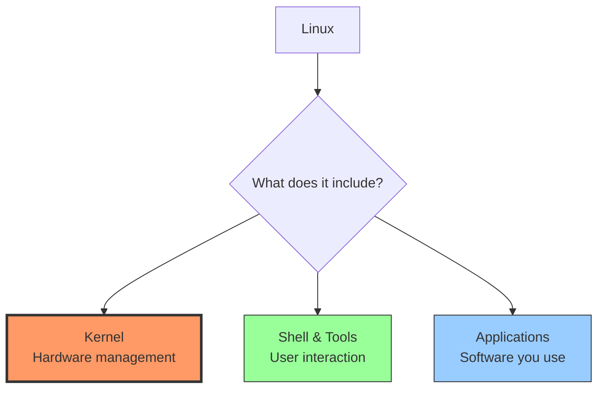
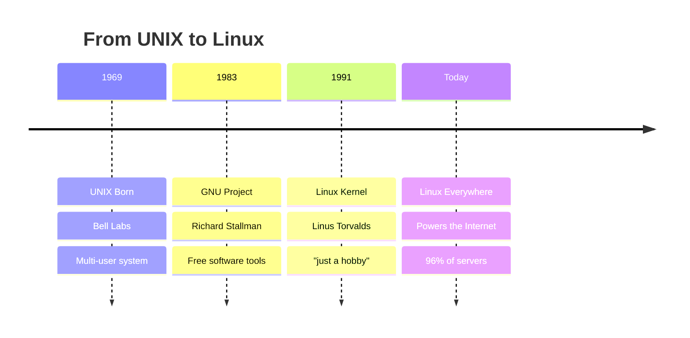
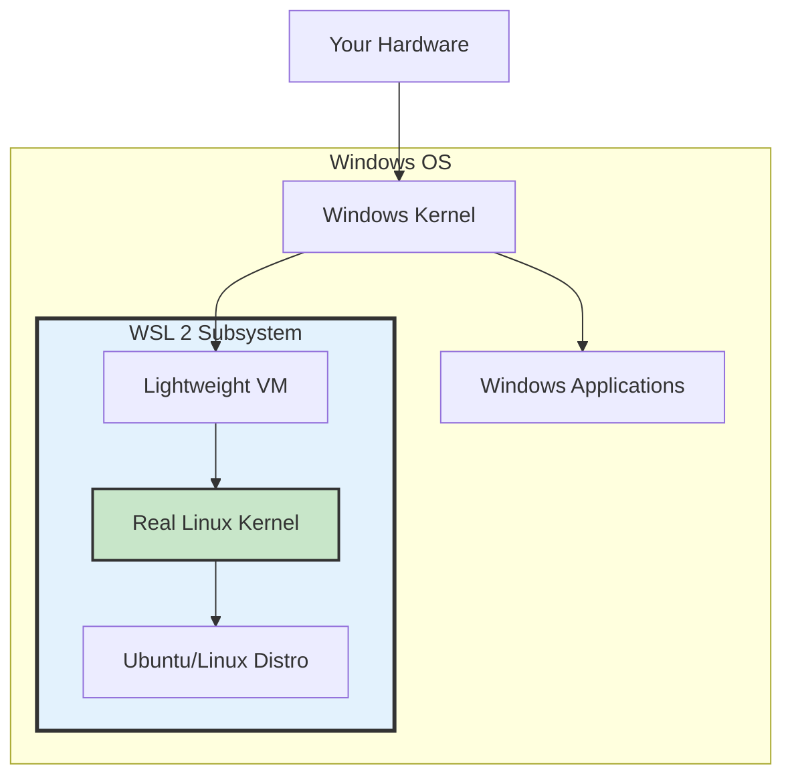
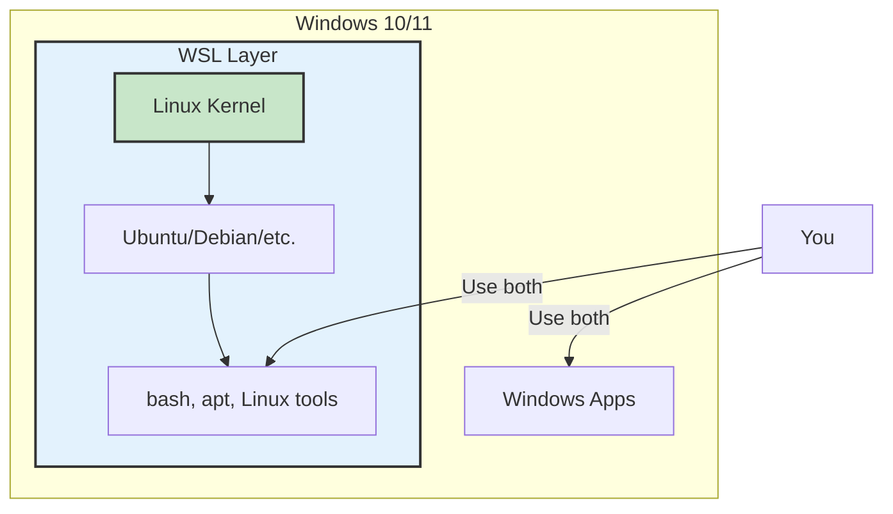

<!-- end_slide -->

# Linux Essentials

## Part 1: Foundations

<!-- pause -->

# What is Linux? 

<!-- end_slide -->

**Is Linux an Operating System** - like Windows or macOS ???

<!-- pause -->

More accurately:

<!-- incremental_lists: true -->

* **Linux** = The kernel (core of the OS)
* **GNU/Linux** = Complete operating system
* **Linux Distributions** = Packaged versions (Ubuntu, Fedora, etc.)

<!-- pause -->



<!-- speaker_note:
Start with the big picture
Linux powers most of the internet
Free and open source
We'll break down each component
-->

<!-- end_slide -->

<!-- jump_to_middle -->

# Understanding Kernel & OS 

<!-- end_slide -->

# What is a Kernel? 

<!-- pause -->

**The Kernel = The Core of the Operating System**

<!-- pause -->

**What it does:**

<!-- incremental_lists: true -->

* Manages hardware (CPU, RAM, disk)
* Controls processes (which programs run)
* Handles memory allocation
* Manages file systems
* Provides security & permissions

<!-- pause -->
<!-- end_slide -->

# What is an Operating System? 

<!-- pause -->

**Operating System = Complete System**

Kernel + Shell + Utilities + Applications

<!-- pause -->

```text
┌──────────────────────────────┐
│  Applications (User Space)   │  ← Firefox, games, etc.
├──────────────────────────────┤
│  Shell & Utilities           │  ← bash, ls, cp, mv
├──────────────────────────────┤
│  Kernel                      │  ← Linux kernel
├──────────────────────────────┤
│  Hardware                    │  ← CPU, RAM, Disk
└──────────────────────────────┘
```

<!-- pause -->

**Components:**
* **Kernel** - Core system management
* **System utilities** - Basic commands and tools
* **Shell** - Command interpreter
* **Desktop Environment** - Graphical interface (optional)
* **Applications** - Programs you use

<!-- end_slide -->

# Kernel vs Operating System

<!-- pause -->

**Kernel** = Just the core
* Linux is technically just a kernel
* ~30 million lines of code
* Created by Linus Torvalds

<!-- pause -->

**Operating System** = Everything
* Linux kernel + GNU tools + Desktop + Apps
* Called "Linux" but technically "GNU/Linux"
* Different "distributions" package it differently

<!-- pause -->

<!-- end_slide -->

<!-- jump_to_middle -->

# Why Linux? 

<!-- pause -->

<!-- columns -->

<!-- column: 0.5 -->

## **Free & Open**
* No licensing costs
* Source code available
* Modify anything
* No vendor lock-in

## **Secure**
* Open source = peer reviewed
* Fast security patches
* Less malware
* Better permissions

<!-- column: 0.5 -->

##  **Powerful**
* Runs for years without reboot
* Efficient resources
* Scales to any size

##  **Dominant**
* 96% of web servers
* 100% of supercomputers
* Billions of Android phones
* All major cloud platforms

<!-- reset_layout -->

<!-- speaker_note:
Windows/Mac are proprietary and expensive
Linux is free and customizable
Most of the internet runs on Linux
If you use the internet, you use Linux!
-->

<!-- end_slide -->

# Why Linux as Students? 

<!-- pause -->

**Perfect for Learning:**

<!-- incremental_lists: true -->

1. **Free** - No cost for software
2. **Learn How Computers Work** - See inside the system
3. **Industry Standard** - Used in most tech companies
4. **Career Skills** - Linux knowledge = job opportunities
5. **Development** - Best environment for programming
6. **Customizable** - Make it yours

<!-- pause -->

**What You Can Do:**

<!-- columns -->

<!-- column: 0.5 -->

* Web development
* Python/Java/C++ programming
* Data science & ML
* Cybersecurity
* DevOps & Cloud

<!-- column: 0.5 -->

* Server management
* Docker & containers
* Git version control
* Database management
* Networking

<!-- reset_layout -->

<!-- speaker_note:
Linux is essential for CS/IT students
Most developer tools are built for Linux first
Learning Linux = learning how software really works
Companies hire Linux-skilled developers
Free means experiment without limits
-->

<!-- end_slide -->

<!-- jump_to_middle -->

# History of Linux 

<!-- end_slide -->

# The Evolution 



<!-- speaker_note:
Quick history - 30 years of evolution
Each step solved a real problem
UNIX was expensive → GNU made free tools
GNU needed kernel → Linus made Linux
Together = revolution
-->

<!-- end_slide -->

# 1969: UNIX 

<!-- columns -->

<!-- column: 0.5 -->

**The Innovation:**
* Multi-user system
* Multi-tasking
* Written in C (portable!)
* Hierarchical file system

<!-- column: 0.5 -->

**The Problem:**
* Proprietary
* Very expensive
* Closed source
* Universities couldn't afford it

<!-- reset_layout -->

<!-- pause -->

<!-- end_slide -->

# 1983: GNU Project 

<!-- pause -->

**Richard Stallman's Mission:**
* Create a free UNIX-like system
* GNU = "GNU's Not Unix"

<!-- pause -->

<!-- columns -->

<!-- column: 0.5 -->

**What GNU Built:**
* GCC compiler
* bash shell
* Core tools (ls, cp, mv)
* Text editor (emacs)

<!-- column: 0.5 -->

**What Was Missing:**
* **The Kernel**

<!-- reset_layout -->

<!-- end_slide -->

# 1991: Linux is Born! 

**August 25, 1991 - Linus Torvalds:**

> "I'm doing a (free) operating system (just a hobby, won't be big and professional like GNU)"

<!-- pause -->

<!-- pause -->
* Linux provided the kernel
* GNU provided everything else
* Together = Full operating system

<!-- speaker_note:
Most famous understatement in computing!
Linux + GNU = GNU/Linux (but we say "Linux")
Now runs the world
-->

<!-- end_slide -->

<!-- jump_to_middle -->

# How WSL Makes Linux Work on Windows

<!-- pause -->

**Traditional Approach:**
* Dual boot (separate partitions)
* Virtual Machine (VMware, VirtualBox)
* Slow and resource heavy

<!-- pause -->

**WSL Approach - Better!**



<!-- pause -->

**WSL Magic:**
* Runs real Linux kernel inside Windows
* Fast (uses lightweight virtualization)
* Shares files between Windows & Linux
* No reboot needed!

<!-- speaker_note:
WSL 2 runs actual Linux kernel via Hyper-V
Not emulation - real Linux system
Best of both worlds: Windows GUI + Linux power
Perfect for students who need both
-->

<!-- end_slide -->

<!-- jump_to_middle -->

# WSL Setup 

<!-- end_slide -->

# What is WSL?

<!-- pause -->

**WSL = Windows Subsystem for Linux**

<!-- pause -->



<!-- pause -->

**What WSL Does:**
* Runs a real Linux kernel on Windows
* Access Linux command line & tools
* No dual boot or VM needed
* Direct file system integration

<!-- pause -->

**Two Versions:**
* **WSL 1:** Translation layer (faster file access)
* **WSL 2:** Real Linux kernel (better compatibility)  Recommended

<!-- speaker_note:
WSL lets Windows users run Linux natively
Perfect for developers who need both systems
WSL 2 uses actual Linux kernel via virtualization
Can run Docker, compile code, use Linux tools
Files accessible from both Windows and Linux
-->

<!-- end_slide -->

# Setting Up WSL 2

<!-- pause -->

## Method 1: Automatic Setup  (Recommended)

**One Command (PowerShell as Admin):**

```powershell
wsl --install
```

<!-- pause -->

**What This Does:**
<!-- incremental_lists: true -->
1. Enables WSL feature
2. Enables Virtual Machine Platform
3. Installs latest Linux kernel
4. Installs Ubuntu by default
5. Restarts your computer

<!-- pause -->

## After Restart:
<!-- incremental_lists: true -->
1. Ubuntu will auto-launch
2. Create your Linux username
3. Set your password
4. You're in Linux! 

<!-- speaker_note:
Method 1 works on Windows 10 (version 2004+) and Windows 11
This is the easiest and recommended method
After restart, Ubuntu terminal opens automatically
Username/password are for Linux only (separate from Windows)
-->

<!-- end_slide -->

# Manual Setup (If Automatic Fails)

<!-- pause -->

## Step 1: Enable WSL Feature

**Run in PowerShell (Admin):**

```powershell
dism.exe /online /enable-feature /featurename:Microsoft-Windows-Subsystem-Linux /all /norestart
```

<!-- pause -->

## Step 2: Enable Virtual Machine Platform

```powershell
dism.exe /online /enable-feature /featurename:VirtualMachinePlatform /all /norestart
```

<!-- pause -->

## Step 3: Restart Computer

**Restart Windows now!**

<!-- speaker_note:
Use this method if wsl --install doesn't work
Usually needed on older Windows 10 versions
Both commands must complete successfully
Don't skip the restart!
-->

<!-- end_slide -->

# Manual Setup (Continued)

<!-- pause -->

## Step 4: Download & Install WSL 2 Kernel

**Visit:**
```
https://aka.ms/wsl2kernel
```

Download and install the update package

<!-- pause -->

## Step 5: Set WSL 2 as Default

**Run in PowerShell (Admin):**

```powershell
wsl --set-default-version 2
```

<!-- pause -->

## Step 6: Install Linux Distribution

```powershell
# Install Ubuntu (recommended for beginners)
wsl --install -d Ubuntu

# Or choose another:
wsl --list --online    # See all available distros
wsl --install -d Debian
wsl --install -d Kali-Linux
```

<!-- pause -->

## Step 7: Launch & Setup

* Start menu → "Ubuntu"
* Create username and password
* Done! 

<!-- speaker_note:
After kernel update, WSL 2 becomes default for new installs
Choose Ubuntu if unsure - most popular and beginner-friendly
First launch will take a minute to set up
Username can be different from Windows username
-->

<!-- end_slide -->

<!-- jump_to_middle -->

# Ubuntu 

<!-- end_slide -->

# What is Ubuntu?

<!-- pause -->

**Ubuntu = A Linux Distribution**

<!-- pause -->

**What's a Distribution?**
* Linux kernel + pre-selected software packages
* Ready-to-use operating system
* Different distros for different needs

<!-- pause -->

**Why Ubuntu?**
<!-- incremental_lists: true -->
* Most popular Linux distro
* Beginner-friendly
* Great documentation
* Huge community support
* Industry standard
* Free and open source

<!-- pause -->

<!-- end_slide -->

<!-- jump_to_middle -->

# Terminal & Shell 

<!-- end_slide -->

# Terminal vs Shell

<!-- pause -->

**Terminal** = The window (app you see)
* GNOME Terminal, iTerm2, Windows Terminal
* Just displays input/output

<!-- pause -->

**Shell** = The interpreter (runs inside terminal)
* bash, zsh, fish
* Translates your commands for the kernel


# Let's Dive In! 

<!-- pause -->

**Next Up:**
* Navigate the file system
* Learn essential commands

<!-- end_slide -->

=======
# Shell Scripting
```
   _____ __         ____   _____           _       __  _            
  / ___// /_  ___  / / /  / ___/__________(_)___  / /_(_)___  ____ _
  \__ \/ __ \/ _ \/ / /   \__ \/ ___/ ___/ / __ \/ __/ / __ \/ __ `/
 ___/ / / / /  __/ / /   ___/ / /__/ /  / / /_/ / /_/ / / / / /_/ / 
/____/_/ /_/\___/_/_/   /____/\___/_/  /_/ .___/\__/_/_/ /_/\__, /  
                                        /_/                 /____/   
```

## What is Shell Scripting?

**Definition:** A shell script is a text file containing a series of commands that the shell can execute.

**Why use scripts?**
* Automate repetitive tasks
* Ensure consistency
* Save time and reduce errors
* Chain multiple commands together

<!-- end_slide -->

## The Shebang Line

**Every script starts with a "shebang" (`#!`)**

```bash
#!/bin/bash
```

**What does it do?**
* Tells the system which interpreter to use
* Must be the very first line
* No spaces before `#!`

**Common Interpreters:**
* `#!/bin/bash` - Bash shell (most common)
* `#!/bin/sh` - POSIX shell (portable)
* `#!/usr/bin/python3` - Python scripts
* `#!/usr/bin/env bash` - Finds bash in PATH

<!-- end_slide -->

## Your First Script

**Let's create a simple "Hello World" script**

```bash +exec
#!/bin/bash

# This is a comment - lines starting with # are ignored
echo "Hello, Workshop Participants!"
echo "Welcome to Shell Scripting"

# Display current date and time
date

# Show who is running this script
echo "Script executed by: $(whoami)"
```

**Key Commands:**
* `echo` - Print text to screen
* `date` - Show current date/time
* `whoami` - Display current username

<!-- end_slide -->

## Making Scripts Executable

**Two ways to run scripts:**

**Method 1: Using bash command**
```bash
bash my_script.sh
```

**Method 2: Make it executable**
```bash
# Give execute permission
chmod +x my_script.sh

# Run it directly
./my_script.sh
```

**Why `./`?**
* Tells shell to look in current directory
* Security feature - prevents running malicious scripts from PATH

<!-- end_slide -->

# Part 2: Variables

## Working with Variables

**Variables store data for later use**

```bash +exec
#!/bin/bash

# Creating variables (NO SPACES around =)
NAME="Linux Workshop"
COUNT=42
DATE=$(date +%Y-%m-%d)

# Using variables (prefix with $)
echo "Event: $NAME"
echo "Participants: $COUNT"
echo "Date: $DATE"

# Arithmetic operations
(( COUNT = COUNT + 8 ))
echo "New count: $COUNT"
```

**Rules:**
* No spaces around `=` sign
* Access with `$` prefix
* Use `$(command)` for command substitution
* Use `$(( ))` for arithmetic

<!-- end_slide -->
=======
## Environment Variables

**Global variables that affect how programs run.**

* **`$HOME`**: Your home folder
* **`$USER`**: Your username
* **`$PATH`**: List of folders where Linux looks for commands

**Why "Command Not Found"?**
If a script is in `/home/user/scripts` but that folder isn't in `$PATH`, you must run it as `./script.sh`.

```bash +exec
echo "My home: $HOME"
echo "My path: $PATH"
```

<!-- end_slide -->

## User Input

**Make scripts interactive with `read` command**

```bash
#!/bin/bash

# Ask for user's name
echo "What is your name?"
read USERNAME

# Ask for favorite language
echo "What's your favorite programming language?"
read LANGUAGE

# Display personalized message
echo ""
echo "Hello, $USERNAME!"
echo "Great choice! $LANGUAGE is awesome."
echo "Let's continue learning!"
```

**Note:** Run this in your terminal, not in the presentation.
Type: `nano input_demo.sh` → paste code → save → `chmod +x input_demo.sh` → `./input_demo.sh`

<!-- end_slide -->

## Command-Line Arguments

**Pass data when running script**

```bash +exec
#!/bin/bash

# Special variables for arguments
# $0 = script name
# $1 = first argument
# $2 = second argument
# $# = total number of arguments
# $@ = all arguments

echo "Script name: $0"
echo "Total arguments: $#"

# Simulate arguments for demo
ARG1="DevOps"
ARG2="2024"

echo ""
echo "First argument: $ARG1"
echo "Second argument: $ARG2"
```

**Usage Example:**
```bash
./my_script.sh DevOps 2024
```

<!-- end_slide -->

# Streams

## Input, Output, and Errors

**Every Linux command has 3 streams:**

1. **STDIN (0):** Standard Input (Keyboard)
2. **STDOUT (1):** Standard Output (Screen)
3. **STDERR (2):** Standard Error (Screen, separate channel)

**Redirection Operators:**
* `>` : Save output to file (overwrite)
* `>>` : Append output to file
* `2>` : Redirect errors only
* `<` : Read input from file

<!-- end_slide -->

# Part 3: Control Flow

## Conditional Statements (if-else)

**Make decisions in your scripts**

```bash +exec
#!/bin/bash

# Check if a file exists
FILE="test.txt"

# Create the file for demo
touch "$FILE"

if [ -f "$FILE" ]; then
    echo "✓ File '$FILE' exists!"
    echo "File size: $(wc -c < $FILE) bytes"
else
    echo "✗ File '$FILE' not found!"
fi

# Clean up
rm -f "$FILE"
```

**Common Test Operators:**
* `-f file` → file exists
* `-d dir` → directory exists
* `-z string` → string is empty
* `$A -eq $B` → numbers are equal
* `$A -lt $B` → A is less than B

<!-- end_slide -->

## More Conditional Examples

**Checking numbers and strings**

```bash +exec
#!/bin/bash

AGE=25

if [ $AGE -ge 18 ]; then
    echo "Age $AGE: Adult ✓"
else
    echo "Age $AGE: Minor"
fi

# String comparison
OS="Linux"

if [ "$OS" = "Linux" ]; then
    echo "Running on $OS - Perfect! 🐧"
elif [ "$OS" = "Windows" ]; then
    echo "Running on $OS"
else
    echo "Unknown OS: $OS"
fi
```

**Operators:**
* `-eq` → equal (numbers)
* `-ne` → not equal
* `-gt` → greater than
* `-ge` → greater or equal
* `=` → equal (strings)
* `!=` → not equal (strings)

<!-- end_slide -->

## For Loops

**Repeat actions multiple times**

```bash +exec
#!/bin/bash

echo "=== Example 1: Simple Range ==="
for i in {1..5}
do
    echo "  Iteration $i"
done

echo ""
echo "=== Example 2: File Operations ==="
# Create demo files
for num in {1..3}
do
    FILENAME="file_$num.txt"
    echo "Processing $FILENAME"
    echo "Content of file $num" > "$FILENAME"
done

# List them
echo ""
echo "Created files:"
ls file_*.txt

# Clean up
rm -f file_*.txt
```

<!-- end_slide -->

## While Loops

**Loop until condition is false**

```bash +exec
#!/bin/bash

echo "Countdown Timer:"

COUNT=5
while [ $COUNT -gt 0 ]
do
    echo "  $COUNT seconds remaining..."
    (( COUNT-- ))
    sleep 1
done

echo "Time's up!"
```

**When to use while:**
* Unknown number of iterations
* Waiting for a condition
* Reading files line-by-line

<!-- end_slide -->

# Functions

## Writing Modular Code

**Functions let you write code once and reuse it.**

**Syntax:**
```bash
function_name() {
    echo "Hello From GDG Linux Workshop"
}
```
```bash
#!/bin/bash

# A function to add two numbers
add_numbers() {
    local A=$1
    local B=$2
    local SUM=$(( A + B ))
    
    # We echo the result to "return" it
    echo $SUM
}

# Capture the output
RESULT=$(add_numbers 10 50)

echo "The result is: $RESULT"
```

<!-- end_slide -->


```
┌───────────────────────────────────────────────────────────────┐
│                                                               │
│   ██████╗ ██████╗  ██████╗  ██████╗███████╗███████╗███████╗   │
│   ██╔══██╗██╔══██╗██╔═══██╗██╔════╝██╔════╝██╔════╝██╔════╝   │
│   ██████╔╝██████╔╝██║   ██║██║     █████╗  ███████╗███████╗   │
│   ██╔═══╝ ██╔══██╗██║   ██║██║     ██╔══╝  ╚════██║╚════██║   │
│   ██║     ██║  ██║╚██████╔╝╚██████╗███████╗███████║███████║   │
│   ╚═╝     ╚═╝  ╚═╝ ╚═════╝  ╚═════╝╚══════╝╚══════╝╚══════╝   │
│                                                               │
└───────────────────────────────────────────────────────────────┘
```

# Part 4: Process Management

## What is a Process?

**Process:** A running instance of a program

**Every process has:**
* **PID (Process ID):** Unique identifier
* **PPID (Parent Process ID):** Who started it
* **State:** Running, Sleeping, Stopped, Zombie
* **Resources:** CPU time, Memory usage

**View your shell's PID:**
```bash +exec
echo "My shell's PID: $$"
echo "My parent's PID: $PPID"
```

<!-- end_slide -->

## Viewing Processes

**Essential commands to monitor processes**

```bash +exec
#!/bin/bash

echo "=== Top 5 Processes by Memory ==="
ps aux --sort=-%mem | head -n 6

echo ""
echo "=== My Running Processes ==="
ps -u $(whoami) -o pid,cmd | head -n 5
```

**Key Commands:**
* `ps aux` → All processes (snapshot)
* `ps -ef` → Full-format listing
* `pgrep name` → Find PID by name
* `top` / `htop` → Real-time monitoring

<!-- end_slide -->

## Background vs Foreground

**Foreground:** Process occupies your terminal

**Background:** Process runs independently

```bash
# Run in foreground (blocks terminal)
sleep 10

# Run in background (returns control)
sleep 10 &

# List background jobs
jobs

# Bring to foreground
fg %1
```

**Live Demo Required:** Try this in your terminal!

<!-- end_slide -->

## Process Control Signals

**Keyboard Shortcuts:**

| Key | Signal | Action |
|-----|--------|--------|
| `Ctrl+C` | SIGINT | Interrupt (kill gracefully) |
| `Ctrl+Z` | SIGTSTP | Suspend (pause) |
| `Ctrl+D` | EOF | End of input |

**Commands:**
* `bg` → Resume suspended process in background
* `fg` → Bring background process to foreground
* `kill PID` → Terminate process
* `kill -9 PID` → Force kill (SIGKILL)

<!-- end_slide -->

## Hands-On: Process Control

**Let's practice process control**

**Step 1:** Open a terminal and run:
```bash
sleep 100
```

**Step 2:** While running, press `Ctrl+Z`
* Process is now suspended

**Step 3:** Type and run:
```bash
bg
```
* Process now runs in background

**Step 4:** Check it's running:
```bash
jobs
```

**Step 5:** Kill it:
```bash
kill %1
```

<!-- end_slide -->

## The kill Command

**Different ways to terminate processes**

```bash +exec
#!/bin/bash

# Start a background process
sleep 30 &
SLEEP_PID=$!

echo "Started sleep with PID: $SLEEP_PID"
echo ""

# Show it's running
echo "Process info:"
ps -p $SLEEP_PID -o pid,cmd,stat

# Kill it gracefully
echo ""
echo "Sending SIGTERM..."
kill $SLEEP_PID

# Wait a moment
sleep 1

# Verify it's gone
if ps -p $SLEEP_PID > /dev/null 2>&1; then
    echo "Process still running (shouldn't happen)"
else
    echo "✓ Process terminated successfully"
fi
```

<!-- end_slide -->

## Signal Types

**Common signals you should know:**

| Signal | Number | Description | Usage |
|--------|--------|-------------|-------|
| SIGTERM | 15 | Graceful termination | `kill PID` |
| SIGKILL | 9 | Force kill | `kill -9 PID` |
| SIGINT | 2 | Interrupt (Ctrl+C) | `kill -2 PID` |
| SIGHUP | 1 | Hang up | `kill -1 PID` |
| SIGSTOP | 19 | Stop/pause | `kill -19 PID` |
| SIGCONT | 18 | Continue | `kill -18 PID` |

**Best Practice:** Always try SIGTERM first, use SIGKILL only if necessary.

<!-- end_slide -->

## Process Priority (nice)

**Control CPU priority of processes**

```bash
# Start with low priority (nice value 10)
nice -n 10 ./my_heavy_script.sh &

# Change priority of running process
renice -n 5 -p PID
```

**Nice Values:**
* Range: -20 (highest priority) to 19 (lowest)
* Default: 0
* Only root can set negative values
* Higher nice value = "nicer" to other processes

<!-- end_slide -->

## Exit Status

**Every command returns an exit code**

```bash +exec
#!/bin/bash

# Successful command
ls /tmp > /dev/null 2>&1
echo "ls exit status: $?"

# Failed command
ls /nonexistent_directory > /dev/null 2>&1
echo "failed ls exit status: $?"

# Custom exit status
function my_function() {
    if [ "$1" = "success" ]; then
        return 0
    else
        return 1
    fi
}

my_function success
echo "Function with success: $?"

my_function fail
echo "Function with fail: $?"
```

**Convention:** 0 = success, non-zero = error

<!-- end_slide -->

## Common Pitfalls to Avoid

**Mistakes beginners make:**

❌ **Spaces around `=` in assignments**
```bash
NAME = "John"  # WRONG
NAME="John"    # CORRECT
```

❌ **Forgetting quotes**
```bash
if [ $VAR = "test" ]    # Breaks if VAR is empty
if [ "$VAR" = "test" ]  # CORRECT
```

❌ **Using `==` in `[ ]`**
```bash
if [ $A == $B ]   # WRONG (Bash-specific)
if [ "$A" = "$B" ]  # CORRECT (POSIX-compliant)
```

❌ **Not checking if file exists**
```bash
cat file.txt  # Fails if file doesn't exist
if [ -f file.txt ]; then cat file.txt; fi  # CORRECT
```

<!-- end_slide -->

## Debugging Scripts

**Tools and techniques:**

**1. Enable debug mode**
```bash
#!/bin/bash -x
# OR
set -x  # Turn on
set +x  # Turn off
```

**2. Check syntax without running**
```bash
bash -n script.sh
```

**3. Use echo statements**
```bash
echo "DEBUG: Variable VALUE = $VALUE"
```

**4. Trap errors**
```bash
trap 'echo "Error at line $LINENO"' ERR
```

**5. Use ShellCheck** (online tool)
* Visit shellcheck.net
* Paste your script
* Get suggestions

<!-- end_slide -->

## Bonus: Quick Reference Card

**Essential Commands:**

| Category | Commands |
|----------|----------|
| **Variables** | `VAR="value"`, `$VAR`, `${VAR}` |
| **Conditionals** | `if [ ]; then; fi`, `[[ ]]`, `-f`, `-d` |
| **Loops** | `for i in; do; done`, `while [ ]; do` |
| **Process** | `ps`, `top`, `kill`, `jobs`, `bg`, `fg` |
| **I/O** | `read`, `echo`, `printf`, `>`, `>>` |
| **Exit** | `exit 0`, `$?` |

# Cron (Run scripts automatically)

Cron = Linux scheduler that runs commands at fixed times.

Edit your cron jobs:
```bash
crontab -e
```
Example: Run a script every day at 2:00 AM
```bash
0 2 * * * /home/user/helper.sh
```


**Keyboard Shortcuts:**
* `Ctrl+C` - Interrupt
* `Ctrl+Z` - Suspend
* `Ctrl+D` - EOF
* `Ctrl+L` - Clear screen

<!-- end_slide -->

```bash
  _______ _                 _                      
 |__   __| |               | |                     
    | |  | |__   __ _ _ __ | | __  _   _  ___  _   _ 
    | |  | '_ \ / _` | '_ \| |/ / | | | |/ _ \| | | |
    | |  | | | | (_| | | | |   <  | |_| | (_) | |_| |
    |_|  |_| |_|\__,_|_| |_|_|\_\  \__, |\___/ \__,_|
                                    __/ |            
                                   |___/
```
